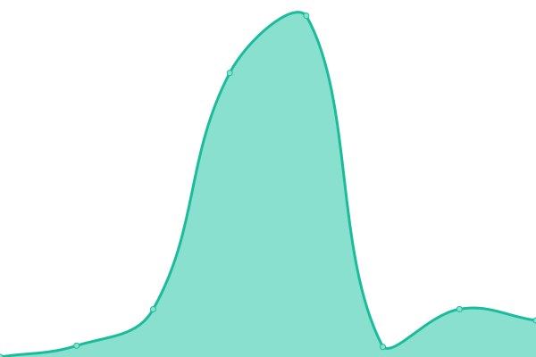

# [📈 Live Status](https://status.appliedhealthinformatics.com/): <!--live status--> **🟧 Partial outage**

This repository contains the open-source uptime monitor and status page for [Hants Williams, PhD, RN](https://status.appliedhealthinformatics.com/), powered by [Upptime](https://github.com/upptime/upptime). It will re-check sites every 30th minute, so at :00 (top of the hour) and :30 (half way through the hour).

[Issues](https://github.com/hantswilliams/upptime/issues) as incident reports
[Actions](https://github.com/hantswilliams/upptime/actions) as uptime monitors

<!--start: status pages-->
<!-- This summary is generated by Upptime (https://github.com/upptime/upptime) -->
<!-- Do not edit this manually, your changes will be overwritten -->
<!-- prettier-ignore -->
| URL | Status | History | Response Time | Uptime |
| --- | ------ | ------- | ------------- | ------ |
|  [SB - Athletics](https://athletics.appliedhealthinformatics.com/) | 🟥 Down | [sb-athletics.yml](https://github.com/hantswilliams/upptime/commits/HEAD/history/sb-athletics.yml) | 

 6341ms
     
 | 

<a href="https://status.appliedhealthinformatics.com/history/sb-athletics">0.00%</a>
    

|  [SBHS - Falls Prevention](https://longislandfallsfree.com/) | 🟩 Up | [sbhs-falls-prevention.yml](https://github.com/hantswilliams/upptime/commits/HEAD/history/sbhs-falls-prevention.yml) | 

 601ms
     
 | 

<a href="https://status.appliedhealthinformatics.com/history/sbhs-falls-prevention">100.00%</a>
    

|  [SBHS - SDoH](https://sdoh.ahi-projects.com/) | 🟩 Up | [sbhs-s-do-h.yml](https://github.com/hantswilliams/upptime/commits/HEAD/history/sbhs-s-do-h.yml) | 

 4305ms
     
 | 

<a href="https://status.appliedhealthinformatics.com/history/sbhs-s-do-h">100.00%</a>
    

|  [SBHS - Smoking API, NY state](https://ny-smoke-api.ahi-projects.com/) | 🟥 Down | [sbhs-smoking-api-ny-state.yml](https://github.com/hantswilliams/upptime/commits/HEAD/history/sbhs-smoking-api-ny-state.yml) | 

 0ms
     
 | 

<a href="https://status.appliedhealthinformatics.com/history/sbhs-smoking-api-ny-state">0.00%</a>
    

|  [SHP - PA Program Analytics](https://pa-program.appliedhealthinformatics.com/) | 🟩 Up | [shp-pa-program-analytics.yml](https://github.com/hantswilliams/upptime/commits/HEAD/history/shp-pa-program-analytics.yml) | 

 2282ms
     
 | 

<a href="https://status.appliedhealthinformatics.com/history/shp-pa-program-analytics">99.81%</a>
    

|  [SHP - QR Code Generator](https://qrcode.appliedhealthinformatics.com/) | 🟩 Up | [shp-qr-code-generator.yml](https://github.com/hantswilliams/upptime/commits/HEAD/history/shp-qr-code-generator.yml) | 

 2146ms
     
 | 

<a href="https://status.appliedhealthinformatics.com/history/shp-qr-code-generator">99.61%</a>
    

|  [SHP-AHI Book - Data Science for Health Informatics](https://book.datascience.appliedhealthinformatics.com/) | 🟩 Up | [shp-ahi-book-data-science-for-health-informatics.yml](https://github.com/hantswilliams/upptime/commits/HEAD/history/shp-ahi-book-data-science-for-health-informatics.yml) | 

 101ms
     
 | 

<a href="https://status.appliedhealthinformatics.com/history/shp-ahi-book-data-science-for-health-informatics">100.00%</a>
    

|  [SHP-AHI Resume Builder](https://resume.appliedhealthinformatics.com/) | 🟩 Up | [shp-ahi-resume-builder.yml](https://github.com/hantswilliams/upptime/commits/HEAD/history/shp-ahi-resume-builder.yml) | 

 104ms
     
 | 

<a href="https://status.appliedhealthinformatics.com/history/shp-ahi-resume-builder">100.00%</a>
    

|  [SHP-AHI Blog](https://blog.appliedhealthinformatics.com/) | 🟩 Up | [shp-ahi-blog.yml](https://github.com/hantswilliams/upptime/commits/HEAD/history/shp-ahi-blog.yml) | 

 141ms
     
 | 

<a href="https://status.appliedhealthinformatics.com/history/shp-ahi-blog">100.00%</a>
    

|  [SHP-AHI-Research - Project Discover](https://discover.appliedhealthinformatics.com/) | 🟩 Up | [shp-ahi-research-project-discover.yml](https://github.com/hantswilliams/upptime/commits/HEAD/history/shp-ahi-research-project-discover.yml) | 

 3476ms
     
 | 

<a href="https://status.appliedhealthinformatics.com/history/shp-ahi-research-project-discover">100.00%</a>
    

|  [SHP-AHI-Research - ClinicalTrials.gov Exploration](https://trials.appliedhealthinformatics.com/) | 🟩 Up | [shp-ahi-research-clinical-trials-gov-exploration.yml](https://github.com/hantswilliams/upptime/commits/HEAD/history/shp-ahi-research-clinical-trials-gov-exploration.yml) | 

 4991ms
     
 | 

<a href="https://status.appliedhealthinformatics.com/history/shp-ahi-research-clinical-trials-gov-exploration">100.00%</a>
    

<!--end: status pages-->

[**Visit our status website →**](https://Hants Williams, PhD, RN.github.io/upptime)

## 📄 License

- Powered by: [Upptime](https://github.com/upptime/upptime)
- Code: [MIT](./LICENSE) © [Anand Chowdhary](https://anandchowdhary.com), supported by [Pabio](https://pabio.com)
- Data in the `./history` directory: [Open Database License](https://opendatacommons.org/licenses/odbl/1-0/)
